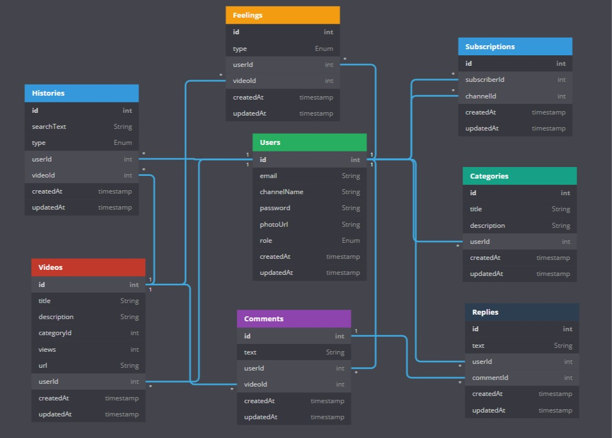

# YoutTube_Clone_Backend Project

#### You can check the screenshots folder to see how this project in live mode looks.


### Technologies Used

- **Node.js**: Runtime environment for the backend server.
- **Express.js**: Web application framework for Node.js.
- **MongoDB**: NoSQL database for data storage.
- **Mongoose**: ODM library for MongoDB and Node.js.
- **bcryptjs**: Library for hashing passwords.
- **jsonwebtoken**: Library for handling JSON Web Tokens (JWT).
- **nodemailer**: Module for sending emails.
- **dotenv**: Module for loading environment variables.
- **express-fileupload**: Middleware for handling file uploads.
- **express-mongo-sanitize**: Middleware for sanitizing MongoDB queries.
- **express-rate-limit**: Middleware for rate limiting API requests.
- **helmet**: Middleware for setting security headers.
- **xss-clean**: Middleware for sanitizing user input to prevent XSS attacks.
- **colors**: Library for adding color to console output.
- **cookie-parser**: Middleware for parsing cookies.
- **hpp**: Middleware for protecting against HTTP Parameter Pollution.
- **morgan**: HTTP request logger middleware for Node.js.

## Frontend Repository
You can visit to its frontend part [here](https://github.com/markus-wilkes/youtube_clone_frontend.github.io)
## Features

> CRUD (Create, Read, Update, and Delete)

- Authentication with JWT (Reset Password with email)
  - Login (User/Admin)
  - Register
  - Forgot Password
- Pagination and search where necessary
- API Security (NoSQL Injections, XSS Attacks, HTTP parameter pollution, etc.)
- Video (CRUD)
  - Upload video
  - Upload video thumbnail
  - Watch video
  - Increase views
  - Like and dislike video
  - Download video
  - Comment & reply for video
  - Update video details
  - Delete video
- Subscribe to a channel
- View liked videos
- Trending
- Subscriptions
- History (CRUD)
  - Watch history
  - Search history
- Settings
  - Modify channel name and email
  - Change password
  - Upload channel avatar


## Database Model

Though the diagram uses sql data type, this diagram is to show you the various collections in the mongo database.



## Requirement

- NodeJS
- MongoDB

## Configuration File

Rename the config/.env.example to .env, then modify to your environment variables, mongodb uri, set your JWT_SECRET and SMTP variables

```ENV
NODE_ENV=development
PORT=3001

MONGO_URI=YOUR_URL

JWT_SECRET=YOUR_SECRET
JWT_EXPIRE=30d
JWT_COOKIE_EXPIRE=30

FILE_UPLOAD_PATH = ./public/uploads
MAX_FILE_UPLOAD = 1000000

SMTP_HOST=smtp.mailtrap.io
SMTP_PORT=2525
SMTP_EMAIL=
SMTP_PASSWORD=
FROM_EMAIL=noreply@quizapp.com
FROM_NAME=QuizzApp
```

Email testing: use mailtrap for email testing, it's easy no stress.

## Installation

Install all npm dependecies

```console
npm install
```

Install nodemon globally

```console
npm install -g nodemon
```

### Note

Make sure you run the seeder to get categories in your database or Create a user with the role admin, then add category with the category endpoint.

Run database seeder

- Seeder folder is \_data/
- Edit the seeder file if you want to

```console
node seeder -i
```

Delete all data

```console
node seeder -d
```

## Start web server

```console
node run dev
```

## Website Screenshots

### Login


### Registration


### Home Page


### Watch Page


## License

This project is licensed under the MIT License

## Developed by Marcus Wilkes

